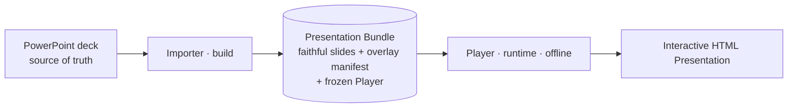
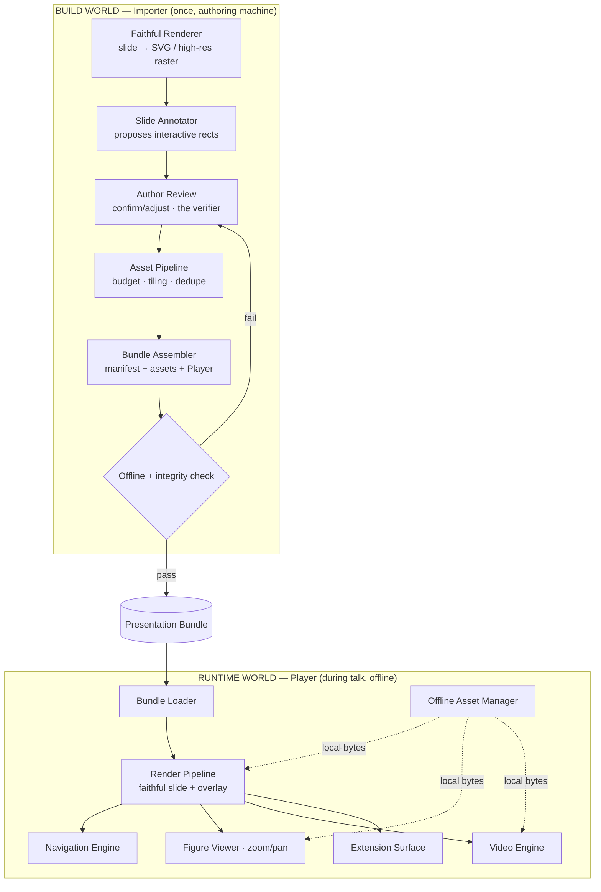
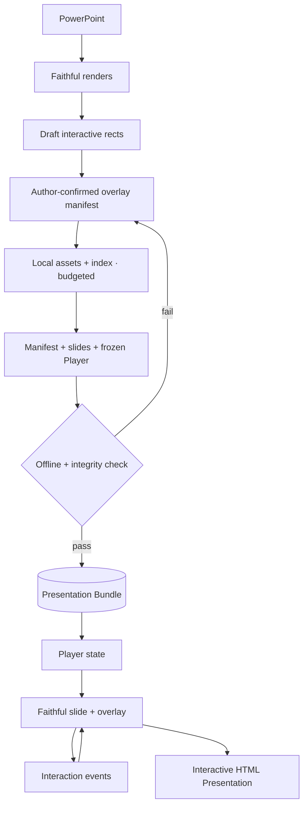
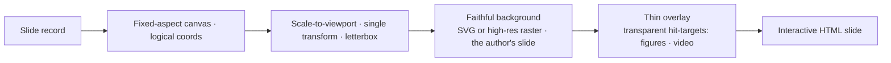
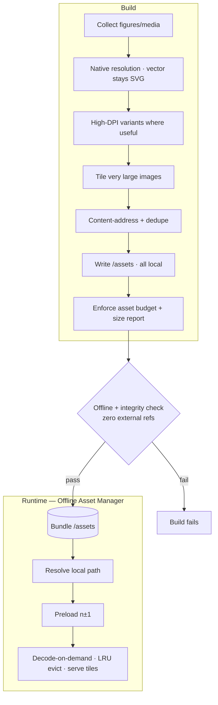
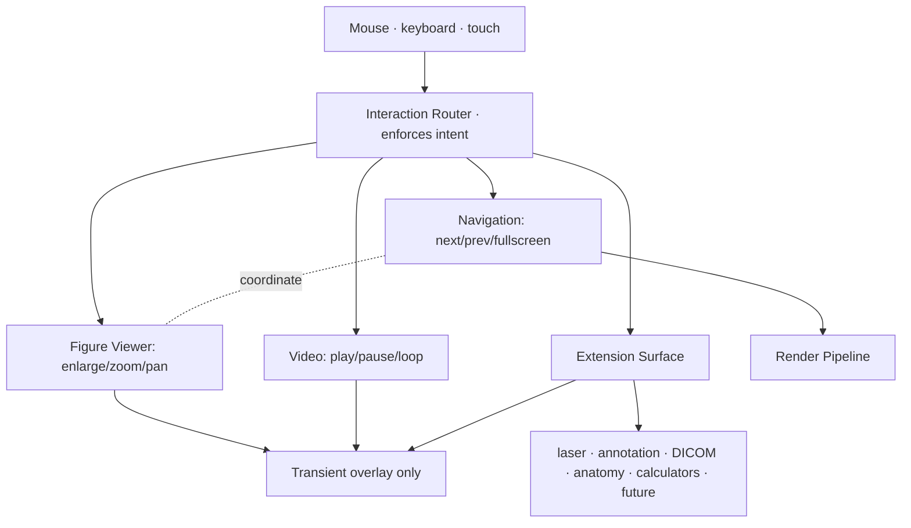
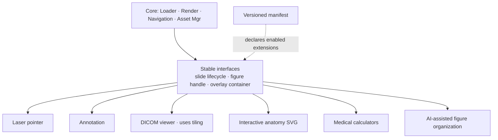

# ARCHITECTURE.md

> System architecture for **frontend-medslides** — an HTML presentation engine for academic medical presentations.
> **Version 2.** Self-contained: an engineer can read this without VISION.md or REQUIREMENTS.md.
> v2 resolves the foundational flaws of v1 (see Appendix B — Changelog). The headline change: a slide is a **faithful render + a thin overlay**, so preserving the author's design — including branding — is true **by construction**, not policed by a runtime layer.

---

## 1. System overview

frontend-medslides turns a finished PowerPoint deck into a **self-contained, offline, interactive HTML presentation** — without redesigning the author's slides.

Two design commitments define everything else:

**(A) Build/runtime split.** All risk and intelligence live in a one-time build; the live runtime is dumb, fast, and unbreakable.

| World | When | Where | Goal |
|-------|------|-------|------|
| **Build** (Importer) | Once, before the talk | Authoring machine | Convert PowerPoint → a verified **Presentation Bundle**. May be slow and smart. |
| **Runtime** (Player) | During the talk | Conference laptop, offline | Play the bundle. Deterministic, network-free, side-effect-free. |

**(B) A slide is a faithful render + a thin overlay.** Each slide is rendered once to a **faithful background** (SVG when the source is clean vector, high-resolution raster otherwise). On top sits a **thin overlay manifest** that annotates *only the rectangles that need behavior* — figures that enlarge, videos, and regions marked non-interactive.

> **Why (B) is the spine of v2.** The runtime never reconstructs a slide semantically and never re-renders branding. Branding, citations, typography, and text are **already pixels in the faithful background** — there is nothing at runtime to move, restyle, or corrupt. "Never alter the author's design" stops being a guarantee the system must enforce and becomes a property it cannot violate. This deletes an entire class of components (theme engine, branding engine, "locked layer" policing) and the entire risk of mis-classifying a region as branding vs. figure.

The **Presentation Bundle** is the contract between the two worlds. Everything before it is replaceable; everything after depends only on the bundle's schema.

---

## 2. Architecture principles

1. **Preservation by construction.** The faithful background *is* the author's slide. The runtime adds behavior on top; it never reconstructs or re-styles the design.
2. **Build-time over run-time.** Anything risky or expensive happens once, in the Importer, and is frozen. The runtime makes no creative decisions.
3. **The bundle is the contract.** A versioned manifest + local assets + a frozen Player fully describe a presentation.
4. **Human-confirmed, never auto-magic.** Where the build must decide which regions are interactive, it *proposes* and the author *confirms*. No silent classifier sits between the author and a shipped slide.
5. **Interaction is tear-down overlays.** Zoom, pan, navigation, future annotation draw on top and restore exact prior state. They never mutate slide content.
6. **Offline-absolute.** Zero network at show time. A build check fails the build if any external reference exists.
7. **Fail safe, never fail loud.** If any feature errors, the slide still shows and navigation still works.
8. **Simple and boring.** Vanilla web platform (HTML/CSS/JS + SVG). No SPA/build framework required to *run*. A contributor must read it end-to-end.
9. **Modular and versioned, frozen per deck.** The Player is frozen into each bundle for reproducibility; schema versioning exists so the *authoring tools* can evolve, not for runtime negotiation.

---

## 3. Component diagram

The build side is **6 components**, the runtime **6 + asset manager** — roughly half of v1, with the theme/branding/citation extractors and the standalone verifier removed.

---

## 4. Primary workflow

```mermaid
flowchart LR
    A[PowerPoint] --> B[Faithful render per slide]
    B --> C[Annotator proposes interactive rects]
    C --> D[Author confirms/adjusts · verifies fidelity by eye]
    D --> E[Process & bundle assets · enforce budget]
    E --> F[Offline + integrity check]
    F -- fail --> D
    F -- pass --> G[(Write bundle: slides + manifest + frozen Player)]
    G --> H[Player loads bundle · offline]
    H --> I[Render: faithful slide + overlay]
    I --> J[Interaction]
    J --> K[Interactive HTML Presentation]
```

The author **is the verifier**: they see each faithful render against their own deck and confirm interactive regions in one pass. Automated pixel-diff verification is a later enhancement (§13), not a v1 dependency. The fail-loop now has a clear owner — the review step — instead of a dead-end "fix import."

---

## 5. Import representation (the foundational decision)

> This is the decision everything downstream depends on. It is recorded as an ADR-style commitment so no one re-litigates it during implementation.

**Decision:** import is **hybrid** — a *faithful render* per slide plus a *thin overlay manifest*. Neither pure-OOXML nor pure-image.

| Rejected option | Why rejected |
|-----------------|--------------|
| **Pure OOXML/.pptx reconstruction** | Requires re-implementing PowerPoint's renderer (fonts, gradients, SmartArt, effects). Enormous, and fidelity — the one thing we must guarantee — would be exactly what we couldn't. |
| **Pure rendered images, then auto-classify regions** | A bitmap has no regions. Classifying figure vs. logo vs. citation from pixels is unreliable, and a single mistake violates the core "never alter branding" invariant. |

**Chosen — hybrid:**
- **Faithful background:** export each slide as **SVG** when the source is clean vector (figures stay crisp at all zoom); **high-resolution raster** otherwise. PowerPoint can produce both. This carries full visual fidelity including branding, citations, typography, and text — as authored.
- **Thin overlay manifest:** annotates only the rectangles that get behavior: figures to enlarge (with native asset + caption link), videos, and explicitly non-interactive zones. Everything not annotated is simply the faithful background.

**Consequences (all positive for our invariants):**
- Branding/citations/typography are pixels in the background → immutable by construction; no theme/branding engine needed at runtime.
- We classify *almost nothing* — only confirm a handful of figure rectangles, with the author in the loop.
- No PowerPoint renderer to reimplement; fidelity is whatever PowerPoint itself exported.
- Cost: branding cannot be re-themed at runtime. VISION *requires* branding to be immutable, so this cost is aligned with the spec.

---

## 6. Major components

Each lists **Purpose · Responsibilities · Inputs · Outputs · Dependencies · Future.**

### 6.1 Faithful Renderer (build)
- **Purpose:** Produce a pixel-faithful background per slide.
- **Responsibilities:** Drive PowerPoint's own export (or an equivalent high-fidelity export) to emit per-slide SVG (preferred for vector-clean slides) or high-res raster. Preserve aspect ratio, slide order, count. Choose SVG-vs-raster per slide by source content.
- **Inputs:** `.pptx` (or its high-fidelity export).
- **Outputs:** One faithful background per slide + deck facts (count, order, aspect ratio).
- **Dependencies:** None upstream.
- **Future:** Per-slide multi-state export for staged builds (§11 scope note).

### 6.2 Slide Annotator (build) — *replaces v1's four extractors*
- **Purpose:** Propose the rectangles that need runtime behavior.
- **Responsibilities:** Identify candidate figures (and embedded media) and emit their bounding boxes + native-asset references. Where source structure (OOXML geometry) is available, use it to seed candidates; otherwise propose by simple heuristics. **Proposes only** — never the final word.
- **Inputs:** Faithful render + any available source geometry/media.
- **Outputs:** Draft overlay records (figure rects, video rects, caption links).
- **Dependencies:** Faithful Renderer.
- **Future:** Better candidate detection (ML-assisted) behind the same propose-then-confirm contract.

### 6.3 Author Review (build) — *the verifier, a first-class step*
- **Purpose:** Put a human between detection and a shipped slide; verify fidelity by eye.
- **Responsibilities:** Show each faithful slide with proposed interactive rects; let the author confirm/adjust figure boundaries, mark non-interactive zones, and link captions. The author visually verifies the render matches their deck. This is the v1 fidelity gate.
- **Inputs:** Faithful renders + draft overlay records.
- **Outputs:** Confirmed overlay manifest per slide.
- **Dependencies:** Slide Annotator.
- **Future:** Automated pixel-diff pre-check that flags suspect slides *before* review (speeds, never replaces, the human).

### 6.4 Asset Pipeline (build)
- **Purpose:** Make every byte offline-ready and bounded.
- **Responsibilities:** Collect figures at native resolution (vector stays SVG); extract embedded video; generate high-DPI variants where useful; **tile very large images**; content-address + dedupe; write to `/assets`; **enforce an asset budget and emit a size report**.
- **Inputs:** Confirmed overlay manifest + source media.
- **Outputs:** Local `/assets` + asset index; size/budget report.
- **Dependencies:** Author Review.
- **Future:** DICOM ingestion and deeper tiling for the medical-image viewer.

### 6.5 Bundle Assembler (build)
- **Purpose:** Freeze the verified presentation into the portable contract.
- **Responsibilities:** Assemble the versioned `manifest.json` (deck facts, slide order, aspect ratio, overlay records, asset index); copy faithful slides + `/assets`; **embed the frozen Player runtime**; choose a delivery form (§9).
- **Inputs:** Confirmed manifest + assets + Player.
- **Outputs:** Draft bundle.
- **Dependencies:** Asset Pipeline.
- **Future:** Single-file (inlined) variant for small decks.

### 6.6 Offline + Integrity Check (build) — the gate
- **Purpose:** Refuse to ship anything that could fail offline or be incomplete.
- **Responsibilities:** Assert **zero external references** anywhere in the bundle; assert every overlay record resolves to a present asset; assert slide count/order intact; assert the budget. Fail the build (back to Review) on any violation.
- **Inputs:** Draft bundle.
- **Outputs:** Pass → final bundle; Fail → report.
- **Dependencies:** Bundle Assembler.
- **Future:** Automated pixel-diff fidelity scoring as an added assertion.

---

### 6.7 Bundle Loader (runtime)
- **Purpose:** Bring the frozen presentation into memory, offline.
- **Responsibilities:** Parse + validate the manifest, build the slide index, prepare the Asset Manager. No network.
- **Inputs:** Presentation Bundle.
- **Outputs:** Ready presentation state.
- **Dependencies:** Bundle, Offline Asset Manager.
- **Future:** none required — Player and manifest are same-version by construction (frozen together).

### 6.8 Render Pipeline (runtime)
- **Purpose:** Show one slide: faithful background + interactive overlay.
- **Responsibilities:** Place a fixed-aspect canvas; scale to viewport via a single transform (letterbox/pillarbox), no reflow; paint the faithful background; lay the thin overlay (transparent hit-targets for figures/videos) on top; preload adjacent slides.
- **Inputs:** Faithful slide + overlay records + viewport size.
- **Outputs:** Rendered slide (background + overlay).
- **Dependencies:** Bundle Loader, Offline Asset Manager.
- **Future:** New overlay types registered without touching the background path.

### 6.9 Navigation Engine (runtime)
- **Purpose:** Mouse-first, reliable, accident-resistant movement.
- **Responsibilities:** next/prev via defined targets; fullscreen toggle; keyboard secondary; suppress accidental advances (clicks on figure/video targets or controls don't navigate); coordinate with the Figure Viewer so the first dismiss closes the viewer, not advances. Slide change ≤100 ms.
- **Inputs:** User events, presentation state.
- **Outputs:** Current-slide changes.
- **Dependencies:** Render Pipeline, Figure Viewer (coordination).
- **Future:** Overview grid, presenter notes, jump-to-slide.

### 6.10 Figure Viewer (runtime) — interaction overlay
- **Purpose:** Inspect scientific detail without altering the slide.
- **Responsibilities:** Click an overlay rect → enlarge that figure into a transient overlay; zoom (≥1×–4×, up to 8× for high-DPI / vector) with **decode-on-demand at zoom time** (don't hold full-res decoded); clamped pan; reset-to-fit; restore exact slide state on exit; suspend navigation while open. Never mutates the slide.
- **Inputs:** Figure asset (+ tiles for large images) + metadata, user events.
- **Outputs:** Transient overlay only.
- **Dependencies:** Offline Asset Manager, Navigation Engine (coordination).
- **Future:** Side-by-side comparison, synchronized pan/zoom, ROI presets, paused-frame video zoom, tiled DICOM.

### 6.11 Video Engine (runtime)
- **Purpose:** Native, offline clinical media.
- **Responsibilities:** Inline playback at the authored rect; play/pause/seek; loop for echo loops; mute-capable; local files only; never streams.
- **Inputs:** Local video assets + placement.
- **Outputs:** Inline playback.
- **Dependencies:** Offline Asset Manager, Render Pipeline.
- **Future:** Frame-step, click-to-enlarge video.

### 6.12 Offline Asset Manager (runtime)
- **Purpose:** Single, reliable, network-free byte source — with a memory ceiling.
- **Responsibilities:** Resolve every asset from local paths; preload adjacent-slide assets; **decode-on-demand and LRU-evict** decoded large figures so memory is bounded; serve tiles for huge images; guarantee no request ever leaves the machine.
- **Inputs:** Asset index, prefetch hints.
- **Outputs:** Ready local assets within a memory budget.
- **Dependencies:** Bundle.
- **Future:** Optional service-worker cache when served locally.

### 6.13 Extension Surface (runtime)
- **Purpose:** Add capability without redesign — and without violating preservation.
- **Responsibilities:** Register extensions as overlays on slide/figure lifecycle hooks. Hand each extension **only a dedicated overlay container** — not arbitrary DOM access — so it draws on top and cannot reach the faithful background. Each extension fails safe in isolation.
- **Inputs:** Lifecycle events, figure/slide handles, manifest extension metadata.
- **Outputs:** Additional overlays.
- **Dependencies:** Render Pipeline.
- **Future:** Laser pointer, annotation, DICOM viewer, interactive anatomy SVG, medical calculators, AI-assisted figure organization.

---

## 7. Data flow

Build flows one direction (source → bundle), gated by human review then automated integrity. At runtime the only loop is **render ⇄ events**; interaction never flows back into the model or bundle. Source and bundle are immutable at show time.

---

## 8. Rendering model

How one slide becomes interactive HTML:

- **The background is the author's slide.** Branding, citations, typography, text, layout — all already pixels, positioned exactly as exported. Nothing reflows; the whole canvas scales by one transform.
- **The overlay is transparent behavior, not content.** Overlay rects are invisible hit-targets aligned to figures/videos. Removing the entire overlay leaves a correct, static slide.
- **Immutability is structural.** There is no runtime branding/citation/text rendering to corrupt — so no "locked layer" to police.
- **Reproducibility is at the bundle level.** Same bundle → same slide records and same overlay geometry everywhere. (Pixel-identical *rasterization* across machines isn't claimed; the faithful background removes per-machine layout drift, which is what mattered.)
- **Assets via the Asset Manager only** — never a remote URL.

---

## 9. Asset pipeline & delivery

**Delivery (the `file://` reality, addressed explicitly):** double-clicking an HTML on `file://` breaks `fetch()` of the manifest, video, and fonts in common browsers. So the bundle ships in one of two concrete forms:
- **Default — portable folder + a tiny bundled launcher** (a minimal local static server / single-click launcher) so everything is served from `http://localhost`. This is the reliable conference path.
- **Small decks — single self-contained HTML** with assets inlined (base64), which *does* open directly.

We do **not** promise "just open the HTML" universally. Either path is fully offline; no CDN, no streaming, ever — enforced by the build check.

---

## 10. Interaction pipeline

Interaction is event-driven overlays, fully separate from rendering. Strip the interaction layer entirely and a correct static slide remains.

- **Overlays never mutate the slide or model**; they tear down and restore exact prior state.
- **The Router enforces intent:** only defined targets navigate; clicks on figure/video targets or active overlays don't advance. While the Figure Viewer is open, navigation is suspended and the first dismiss closes it.
- **Extensions get a container, not the DOM** — they cannot reach the faithful background.
- **Fail safe:** an erroring overlay/extension is isolated; slide + navigation keep working.

---

## 11. Future extension model

- Extensions are **overlays only**, sandboxed to a container; they cannot reflow slides or touch the faithful background.
- The **manifest schema is versioned** so authoring tools and overlay types evolve backward-compatibly. (No *runtime* version negotiation — the Player is frozen with each deck.)
- **Tiling in the Asset Manager seeds the DICOM/medical-image path**, so that future module is an extension, not a redesign.
- No extension may weaken preservation, offline, or reliability — the global priority order governs the runtime.

**Scope note — staged builds/animations.** v1 renders each slide as its **final flattened state**; sequential reveals (appearing arrows, step-by-step bullets) are **not** supported in v1. They become a later enhancement via **multi-state slides** (the Faithful Renderer emits N states per slide; the overlay steps through them) — additive, no core redesign.

---

## 12. Technology posture (deliberately minimal)

- **Runtime:** plain HTML + CSS + JS, SVG for vector figures. No SPA/build framework to *run*. Small enough to read end-to-end.
- **Build:** may use tooling to drive PowerPoint export and process assets; its only output is a static bundle + a frozen Player.
- **State** at runtime is minimal and in-memory (current slide, viewer state); nothing persists into the source or bundle.

> Fewer moving parts = fewer ways to fail mid-talk.

---

## 13. v1 scope vs. later

**v1 core (build):** Faithful Renderer · Slide Annotator · Author Review · Asset Pipeline (budget + tiling) · Bundle Assembler · Offline+Integrity Check.
**v1 core (runtime):** Bundle Loader · Render Pipeline · Navigation · Figure Viewer (zoom/pan, decode-on-demand) · Video Engine · Offline Asset Manager (LRU).
**Later (additive, no redesign):** automated pixel-diff verification · single-file delivery · staged-build multi-state slides · Extension Surface modules (laser, annotation, DICOM, anatomy, calculators, AI figure organization) · presenter notes / overview grid.

---

## Appendix A — Summary

- **Two worlds, one contract:** a smart Importer produces a verified static **Presentation Bundle**; a frozen, offline Player plays it.
- **A slide is a faithful render + a thin overlay**, so preserving the author's design — branding included — is **structural, not policed**.
- **A human confirms** interactive regions; no silent classifier can break the core invariant.
- **Everything is local**, bounded by an asset budget and a runtime memory ceiling; the build refuses to ship external references.
- **Extensibility** rides the Extension Surface + versioned manifest, so medical-imaging modules grow without redesign.

## Appendix B — Changelog (v1 → v2)

| Area | v1 | v2 |
|------|----|----|
| Import representation | Undefined; assumed structure *and* image fidelity at once | **Committed hybrid:** faithful render (SVG/raster) + thin overlay (§5) |
| Branding/citations | Theme + Branding engines rendering a "locked layer" the runtime must police | **Baked into the faithful render** → immutable by construction; engines deleted |
| Region detection | Automatic classification (figure/logo/citation) | **Propose-then-confirm** with a first-class Author Review step |
| Verifier | Circular "2% diff" gate with no human owner | Author Review *is* the v1 verifier; automated pixel-diff is later |
| Build components | ~9 (four overlapping extractors + standalone verifier) | **6**, extractors collapsed into one Annotator |
| Player versioning | Contradiction: bundled Player + runtime negotiation | **Frozen Player per bundle**; schema versioning for authoring tools only |
| Delivery | "Just open the HTML" (false on `file://`) | **Bundled launcher** (default) or **inlined single file** (small decks) |
| Resources | Unbounded preload; "USB/email-sized" | **Asset budget + size report**, tiling, decode-on-demand, LRU eviction |
| Reproducibility | "Byte-identical DOM/render" overclaim | Reproducible at **bundle level**; faithful background removes layout drift |
| Builds/animations | Unaddressed | **Explicit v1 scope cut**; multi-state slides later |

---

> **PowerPoint creates the presentation. frontend-medslides plays it — faithfully, offline, and reliably — and cannot redesign the author's work, because the author's slide is what it renders.**
