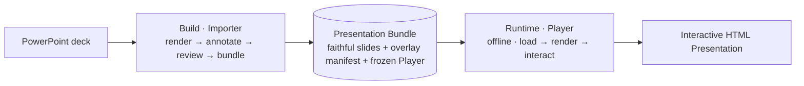
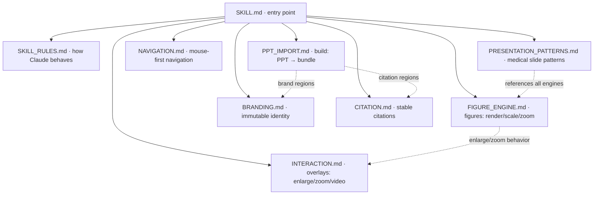
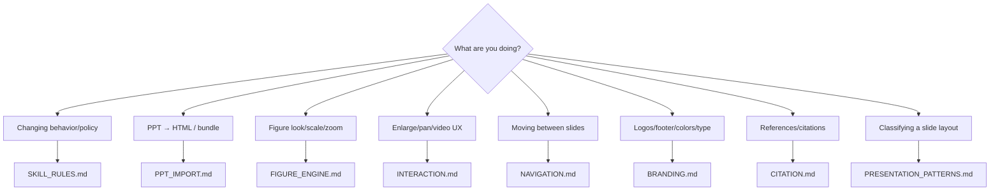

# frontend-medslides

> **PowerPoint creates the presentation. frontend-medslides plays it — faithfully, offline, and reliably — and cannot redesign the author's work, because the author's slide is what it renders.**

This is the **entry point** for the frontend-medslides skill. It is a map, not a manual: it tells you *what the project is*, *how it is organized*, and *which document to open for the task in front of you*. It deliberately does **not** duplicate the detail held in `docs/` — each rule lives in exactly one place.

---

## 1. What this skill is

frontend-medslides converts a finished **PowerPoint** deck into a **self-contained, offline, interactive HTML presentation** for **academic medical talks** — without altering the author's design.

- **PowerPoint = source of truth.** Authoring stays in PowerPoint.
- **HTML = presentation environment.** Live delivery, sharing, interaction.
- Slides are **figure-first** (CT, MRI, angiography, echocardiography, pathology, forest plots, Kaplan–Meier curves, clinical tables), not text-first.

---

## 2. Project philosophy (the one rule above all)

**Preserve the author's presentation. Enhance only the presentation experience.**

Everything in this skill descends from that sentence. When a decision is uncertain, **preserve rather than redesign**. The detailed behavioral contract lives in **[docs/SKILL_RULES.md](docs/SKILL_RULES.md)** — read it before making any change.

---

## 3. Overall workflow

A slide is a **faithful render + a thin overlay**. The system splits cleanly into a one-time **build** and a live **runtime**, joined by one artifact: the **Presentation Bundle**.

The architectural reasoning behind this split (and why it makes preservation *structural*) is in `ARCHITECTURE.md` at the project root. The docs below cover each stage in depth.

---

## 4. Documentation map

`SKILL.md` (this file) points to focused documents, each with a **single responsibility**. Read the one that matches your task; follow cross-references as needed.

| Document | Owns | Open it when you are… |
|----------|------|-----------------------|
| **[docs/SKILL_RULES.md](docs/SKILL_RULES.md)** | Claude's behavior, decision hierarchy, review process, hard prohibitions | …about to change anything — read first |
| **[docs/PPT_IMPORT.md](docs/PPT_IMPORT.md)** | The build pipeline: faithful render, annotation, review, bundling; PPT as source of truth | …working on import / the bundle / manifest |
| **[docs/FIGURE_ENGINE.md](docs/FIGURE_ENGINE.md)** | Figure rendering, scaling, aspect ratio, high-res, multi-panel, zoom/pan internals, caching | …working on how figures look and scale |
| **[docs/NAVIGATION.md](docs/NAVIGATION.md)** | Mouse-first prev/next, fullscreen, presenter mode, accident prevention | …working on moving between slides |
| **[docs/BRANDING.md](docs/BRANDING.md)** | Immutable identity: logos, footer, blue line, background, palette, type hierarchy | …anywhere near institutional branding |
| **[docs/CITATION.md](docs/CITATION.md)** | Citation placement, typography, alignment, spacing, stability | …working on references/citations |
| **[docs/INTERACTION.md](docs/INTERACTION.md)** | The overlay layer: click-to-enlarge, zoom/pan UX, video, SVG, future annotation/laser | …adding presentation-time interaction |
| **[docs/PRESENTATION_PATTERNS.md](docs/PRESENTATION_PATTERNS.md)** | Reusable academic-medical slide patterns (layout primitives) | …classifying a slide or guiding AI generation |

**Root design docs** (the "why"): `VISION.md` (intent + non-negotiables), `REQUIREMENTS.md` (measurable MUST/SHOULD/NICE-TO-HAVE), `ARCHITECTURE.md` (component design, v2).

---

## 5. Decision hierarchy

When two concerns conflict, resolve **top-down**. This order is canonical; every document defers to it. (Full statement and rationale in [docs/SKILL_RULES.md](docs/SKILL_RULES.md) §Decision hierarchy.)

1. **Preservation of the author's design** — never auto-redesign (see BRANDING, CITATION, PPT_IMPORT)
2. **Reliability & offline robustness** — no feature may risk failing mid-talk
3. **Figure readability** — the scientific content is the point (see FIGURE_ENGINE)
4. **Citation readability** — present and stable (see CITATION)
5. **Overall visual balance**
6. **Text readability**
7. **Decorative / experiential enhancements** (see INTERACTION)

---

## 6. Which document for which task (quick router)

If a task spans several (e.g. "click-to-enlarge a forest plot"): start at the **owning** doc for the core change (FIGURE_ENGINE for rendering, INTERACTION for the enlarge UX), then follow cross-references.

---

## 7. Terminology (canonical)

These terms mean the same thing in every document. The full glossary will live in `docs/GLOSSARY.md` (future); the essentials:

- **Source of truth** — the original PowerPoint deck.
- **Build world / Importer** — the one-time conversion (PPT → bundle). May be slow and smart.
- **Runtime world / Player** — the live, offline presentation engine. Dumb, fast, unbreakable. **Frozen into each bundle.**
- **Presentation Bundle** — the deliverable and the contract: `manifest.json` + faithful slides + `/assets` + the frozen Player.
- **Faithful background / faithful render** — each slide rendered once to SVG (vector-clean) or high-res raster; carries branding, citations, typography, text as authored.
- **Thin overlay / overlay records** — the only structured data: transparent hit-targets for figures/videos + non-interactive zones. Annotated by the **Slide Annotator** (proposes) and **Author Review** (confirms — the verifier).
- **Immutable elements** — institutional identity (logos, footer, bottom blue line, background, citation style). Preserved **by construction** — they are pixels in the faithful background.
- **Propose-then-confirm** — the build proposes interactive regions; a human confirms. No silent classifier ships a slide.

---

## 8. Long-term growth

The documentation scales by adding focused files, not by enlarging existing ones. Planned future docs slot in without restructuring: `DICOM.md`, `THEMES.md`, `EXPORT.md`, `ANIMATION.md`, `AI_ASSISTANT.md`, `MEDICAL_MEDIA.md`, `GLOSSARY.md`, `BUNDLE_SPEC.md`. When you add one, register it in the §4 map and the §6 router — nowhere else.

> Each document has one responsibility. Nothing is duplicated. Everything cross-references. Start here, then go deep.
