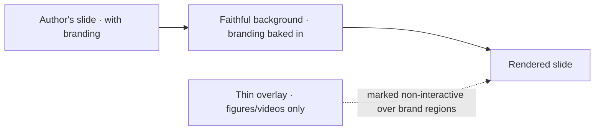
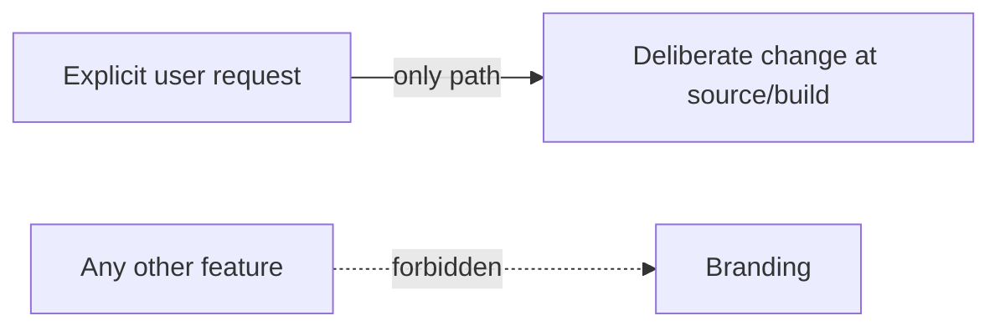

# BRANDING.md

> **Institutional identity — immutable.**
> This document owns: hospital logo, university logo, footer, the bottom blue line, background, color palette, typography hierarchy, and overall institutional identity — and the rule that all of these are immutable.
> Entry: [../SKILL.md](../SKILL.md) · Behavior: [SKILL_RULES.md](SKILL_RULES.md) · How import preserves them: [PPT_IMPORT.md](PPT_IMPORT.md) §5.4–5.5.

These elements define the author's presentation identity. **They are never modified, moved, recolored, or removed automatically.**

---

## 1. Why branding is safe by construction

In frontend-medslides, a slide is a **faithful render + a thin overlay** ([PPT_IMPORT.md](PPT_IMPORT.md) §2). Branding is part of the faithful background — **it is already pixels**. There is no runtime "branding layer" or theme engine that could alter it, and therefore nothing to police.

> Immutability is not a feature we enforce at runtime — it is a property the architecture cannot violate. This is the strongest possible guarantee for "do not alter institutional branding."

The build's only branding responsibility is to **mark brand regions non-interactive** so no figure/video overlay can sit on a logo, footer, or the blue line ([PPT_IMPORT.md](PPT_IMPORT.md) §5.4).

---

## 2. The immutable elements

| Element | Rule |
|---------|------|
| **Hospital logo** | Preserved exactly — same asset, position, size. |
| **University logo** | Preserved exactly. |
| **Footer** | Preserved in position, content, color. |
| **Bottom blue horizontal line** | Preserved in position, thickness, color. |
| **Background color** | Preserved exactly (exact source value). |
| **Color palette** | Preserved as authored; never remapped/themed. |
| **Typography hierarchy** | Relative sizes, weights, emphasis ordering preserved (it's in the render). |
| **Citation style & placement** | Immutable — owned in detail by [CITATION.md](CITATION.md). |

---

## 3. Typography hierarchy

Typography is **already pixels in the faithful background**, so the hierarchy (relative sizes, weights, spacing, margins, visual balance) is preserved by the render itself — there is no runtime re-styling. The build only verifies that **all fonts are bundled locally** and that **no webfont/CDN reference** exists (offline-absolute); appearance is guaranteed by the render regardless of font availability on the show machine. Detail: [PPT_IMPORT.md](PPT_IMPORT.md) §5.2.

---

## 4. The one legitimate path to change branding

Branding changes **only** through an **explicit, user-initiated action** — never as a side effect of any other feature. If a user explicitly requests a branding change, it is a deliberate edit to the source/build, not a runtime transformation.

This mirrors the hard prohibition in [SKILL_RULES.md](SKILL_RULES.md) §8.3.

---

## 5. Interaction with branding regions

- Overlays (figure viewer, video, future annotation/laser — [INTERACTION.md](INTERACTION.md)) are constrained so they **cannot cover, move, or restyle** brand regions.
- Brand regions are marked **non-interactive** at build time; clicks there do nothing (they certainly never navigate — [NAVIGATION.md](NAVIGATION.md) §3).
- If a candidate figure box overlaps a brand region, the build flags it for the author to resolve in **Author Review** ([PPT_IMPORT.md](PPT_IMPORT.md) §6) — detection never silently wins.

---

## 6. What this means for contributors

- **Never** add a feature that recolors, re-themes, repositions, or hides any element in §2.
- **Never** lift branding into a runtime theme system "for flexibility" — that reintroduces a risk the architecture deliberately removed.
- **Never** assume a logo/footer is "just decoration" you can reflow — it is institutional identity.
- A future `THEMES.md` may describe *opt-in, explicit* theming for net-new (non-imported) decks; it must never apply to imported author slides without explicit request.

---

## 7. Cross-references

- Build-time location/marking of brand regions: [PPT_IMPORT.md](PPT_IMPORT.md) §5.4–5.5
- Citations (a branded, immutable element): [CITATION.md](CITATION.md)
- Overlay constraints near branding: [INTERACTION.md](INTERACTION.md)
- Clicks on brand regions never navigate: [NAVIGATION.md](NAVIGATION.md) §3
- Prohibitions: [SKILL_RULES.md](SKILL_RULES.md) §8
