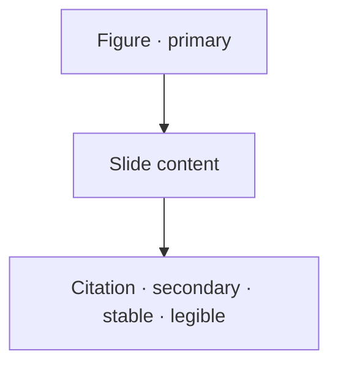

# CITATION.md

> **Scientific citations — present, legible, and perfectly stable.**
> This document owns: citation placement, typography, font hierarchy, alignment, spacing, reference formatting, and citation consistency across the presentation.
> Entry: [../SKILL.md](../SKILL.md) · Immutability context: [BRANDING.md](BRANDING.md) · Build preservation: [PPT_IMPORT.md](PPT_IMPORT.md).

Citations are an **immutable identity element** (decision hierarchy #4, just below figures). They must be readable and must **never move unpredictably**.

---

## 1. Why citations are stable by construction

Like branding, citations are part of the **faithful background** — they are pixels, positioned exactly as authored ([PPT_IMPORT.md](PPT_IMPORT.md) §2). There is no runtime text layout that could shift them between renders, navigations, or viewport sizes.

> "Citations never move unpredictably" is therefore guaranteed by the rendering model, not by runtime positioning logic.

---

## 2. The citation rules

| Property | Rule |
|----------|------|
| **Style** | Font, size, color, format preserved exactly as authored. |
| **Placement** | Preserved exactly; **stable** — never moves between renders, navigations, or viewports. |
| **Hierarchy** | Visually **secondary** — never enlarged, emphasized, or promoted above figure/content readability, while staying legible. |
| **Alignment** | Preserved relative to its anchor (figure edge / slide edge). |
| **Spacing** | Preserved relative to its anchor; consistent across slides. |
| **Consistency** | The same citation style/position behaves identically deck-wide. |

---

## 3. Visual hierarchy

Citations sit **below figures and primary content** in the visual hierarchy but are always **present and legible**:

- Never let a feature **enlarge or highlight** a citation above its authored prominence.
- Never let an interactive overlay **cover** a citation — overlays are constrained away from it, exactly as with branding ([INTERACTION.md](INTERACTION.md), [BRANDING.md](BRANDING.md) §5).
- Zoom/pan of a figure ([FIGURE_ENGINE.md](FIGURE_ENGINE.md)) must not displace the base-slide citation.

---

## 4. Reference formatting & the References slide

- Inline citations follow whatever scientific format the author used (Vancouver, numbered superscripts, etc.) — **preserved, not normalized**.
- A dedicated **References slide** is a recognized pattern with its own layout guidance — see [PRESENTATION_PATTERNS.md](PRESENTATION_PATTERNS.md) (References Slide).
- **Future** (opt-in, never changing visible placement): citation→reference linking (click an inline citation to jump to the References slide). Tracked as a NICE-TO-HAVE; must not alter on-slide appearance.

---

## 5. Consistency contract

Because citations are baked into the faithful render, consistency is automatic — but contributors must preserve it:

- **Never** reposition, realign, or re-space a citation to "balance" a slide (decision hierarchy: balance #5 < citation #4).
- **Never** restyle citation typography to match a theme.
- **Never** treat a citation region as available space for an overlay or control.

---

## 6. Cross-references

- Immutability model (shared with branding): [BRANDING.md](BRANDING.md)
- Build-time citation-region handling: [PPT_IMPORT.md](PPT_IMPORT.md) §5.4
- Citations must not be covered/displaced by overlays: [INTERACTION.md](INTERACTION.md)
- References-slide layout: [PRESENTATION_PATTERNS.md](PRESENTATION_PATTERNS.md)
- Prohibitions: [SKILL_RULES.md](SKILL_RULES.md) §8.4
