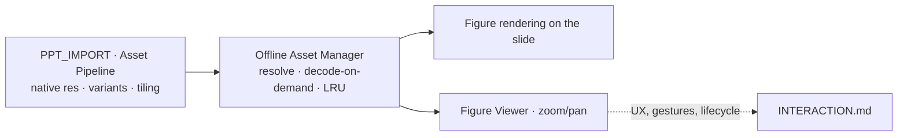
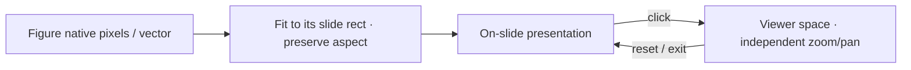
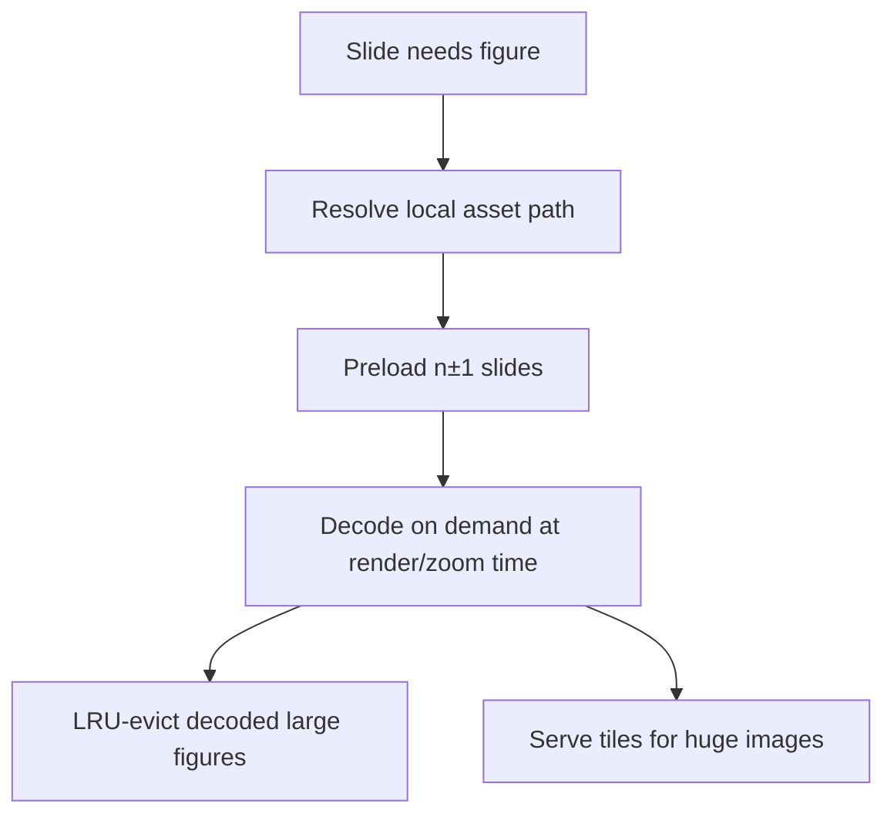

# FIGURE_ENGINE.md

> **How scientific figures are rendered, scaled, and inspected.**
> This document owns: figure rendering, image scaling, aspect-ratio preservation, high-resolution rendering, multi-panel & comparison figures, plot/medical-image handling, caching/memory, and the internals of figure zoom & pan. The *interaction UX* of enlarging a figure lives in [INTERACTION.md](INTERACTION.md); this doc owns *how the pixels behave*.
> Entry: [../SKILL.md](../SKILL.md) · Behavior: [SKILL_RULES.md](SKILL_RULES.md) · Build/assets: [PPT_IMPORT.md](PPT_IMPORT.md).

**Scientific figures are the highest content priority** (decision hierarchy #3). The framework is figure-first.

---

## 1. Responsibility split

- **Build** prepares figure bytes: native resolution, high-DPI variants, tiles, dedupe (see [PPT_IMPORT.md](PPT_IMPORT.md) §7).
- **This engine** governs how figures *render and scale* on the slide and *inside the viewer*, plus the memory model.
- **[INTERACTION.md](INTERACTION.md)** governs the *gestures and lifecycle* of enlarging (click, double-click reset, dismiss, navigation suspension).

---

## 2. Figure rendering principles

1. **Native resolution, no quality loss.** A figure renders at its native resolution and is never upscaled-blurry or downscaled below source. Target: no perceptible quality loss vs. source at 100% and at maximum zoom.
2. **Aspect ratio is sacred.** No stretching, squashing, or auto-crop — ever. Width:height is preserved at every scale.
3. **Figures dominate.** On figure-centric slides the principal figure occupies a large share of the usable area (the patterns in [PRESENTATION_PATTERNS.md](PRESENTATION_PATTERNS.md) give per-pattern targets, e.g. ~70–90% for a single large figure), preserving the author's proportion — never shrunk below source scale.
4. **Vector stays vector.** SVG figures (many forest plots, KM curves, diagrams) render as SVG and stay crisp at all zoom levels; raster is used only when the source is raster.

---

## 3. Scaling model

The slide is a fixed-aspect canvas scaled to the viewport by a **single transform** (see `ARCHITECTURE.md` §8). Figures inherit that transform on the slide; in the viewer they get their own.

- **On-slide:** the figure is fit into its authored rectangle, aspect preserved, letterboxed within the rect if needed (never cropped).
- **In-viewer:** an independent transform supports zoom and pan without affecting the slide.
- **High-DPI:** when a high-DPI variant exists, it is selected for crisp rendering on 4K projectors.

---

## 4. Zoom & pan internals

Behavior the viewer must guarantee (the *UX wrapper* — gestures, dismiss — is [INTERACTION.md](INTERACTION.md)):

- **Zoom range:** at least **1×–4×**; up to **8×** for high-DPI variants and vector figures (vectors can zoom further with no quality loss).
- **In-bounds guarantee:** the image can never be lost off-screen. **Pan is clamped** so the figure cannot be dragged completely out of view.
- **Cursor-centered zoom:** wheel/double-click zoom centers on the cursor.
- **Reset-to-fit:** a single action returns to fit-the-viewer scale (double-click reset — see [INTERACTION.md](INTERACTION.md)).
- **Smoothness vs. reliability:** zoom/pan target ≥30 fps (60 fps ideal), degrading gracefully rather than stalling. Never block the talk for an effect (decision hierarchy #2).
- **Legibility goal:** zoom must make the smallest authored labels (forest-plot CIs, KM risk tables, table cells) readable at no worse than the source's intended reading size.

---

## 5. Multi-panel & comparison figures

- **Multi-panel composites** (A/B/C/D, before/after) are preserved as a **single composite exactly as authored** — panels are never separated or rearranged. The build marks them with a multi-panel flag ([PPT_IMPORT.md](PPT_IMPORT.md) §5.3).
- The viewer allows **zoom/pan within** a composite so one panel can be inspected without splitting it.
- **Figure comparison mode** (two figures or two slides' figures side-by-side with synchronized zoom/pan) is a **future** capability; the engine's independent-transform model is designed to accommodate it without redesign. Patterns: [PRESENTATION_PATTERNS.md](PRESENTATION_PATTERNS.md) (Two-Figure Comparison, CT/MRI Comparison, Before/After).

---

## 6. Plot & medical-image specifics

| Figure type | Rendering note |
|-------------|----------------|
| **Forest plot** | Usually vector → SVG; CIs and labels must stay crisp and legible at zoom. |
| **Kaplan–Meier curve** | Vector → SVG; risk tables below the curve are small — zoom legibility (§4) is the key requirement. |
| **CT / MRI** | High-res raster; tiled if very large; window/level is *as authored* (no runtime re-windowing in v1). |
| **Angiography** | Often video (echo-like runs) → [INTERACTION.md](INTERACTION.md) §video; still frames as high-res raster. |
| **Echocardiography** | Predominantly **video loops** — see [INTERACTION.md](INTERACTION.md). Still frames here. |
| **Pathology** | Very high-res raster; **tiling** matters most here; prime candidate for the future tiled viewer. |
| **Clinical table** | May be raster or vector; legibility-at-zoom is the priority. |

> v1 renders medical images **as authored**. Interactive re-windowing, measurement, and DICOM are future modules (§8).

---

## 7. Caching & memory model

Large medical decks can hold many full-resolution images. The **Offline Asset Manager** bounds memory so navigation never degrades.

- **Decode-on-demand:** don't hold full-resolution decoded bitmaps; decode when about to render or zoom.
- **Adjacent preload:** slides n±1 are preloaded so prev/next is instant ([NAVIGATION.md](NAVIGATION.md) requires ≤100 ms).
- **LRU eviction:** decoded large figures are evicted under a memory ceiling — bounded footprint for hour-long talks.
- **Tiling:** very large images serve tiles, so zoom into a region doesn't decode the whole image.
- **Never block navigation:** decoding/loading must not stall slide changes (decision hierarchy #2 over #3 for *responsiveness*, while figure *quality* is never sacrificed).

---

## 8. Future medical-image support

Designed to slot in as extensions ([INTERACTION.md](INTERACTION.md) §extensions, `ARCHITECTURE.md` §11), no core redesign:

- **DICOM viewer** (`DICOM.md`, future) — reuses the **tiling** model; adds window/level, stack scroll, measurement.
- **Interactive anatomy SVG** — clickable regions on vector figures.
- **ROI presets** — saved zoom targets an author steps through.
- **Paused-frame video zoom** — zoom/pan a frozen echo/angio frame.
- **Comparison mode** — synchronized multi-figure inspection (§5).

---

## 9. Cross-references

- Build/asset preparation: [PPT_IMPORT.md](PPT_IMPORT.md) §7
- Enlarge/zoom **UX & lifecycle**: [INTERACTION.md](INTERACTION.md)
- Navigation timing constraints: [NAVIGATION.md](NAVIGATION.md)
- Per-slide figure-priority targets: [PRESENTATION_PATTERNS.md](PRESENTATION_PATTERNS.md)
- Behavior & prohibitions: [SKILL_RULES.md](SKILL_RULES.md)
