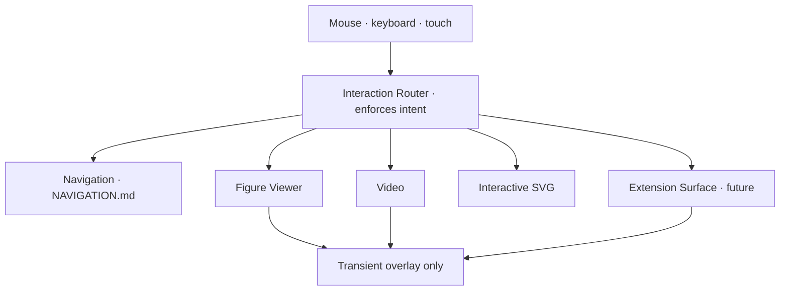
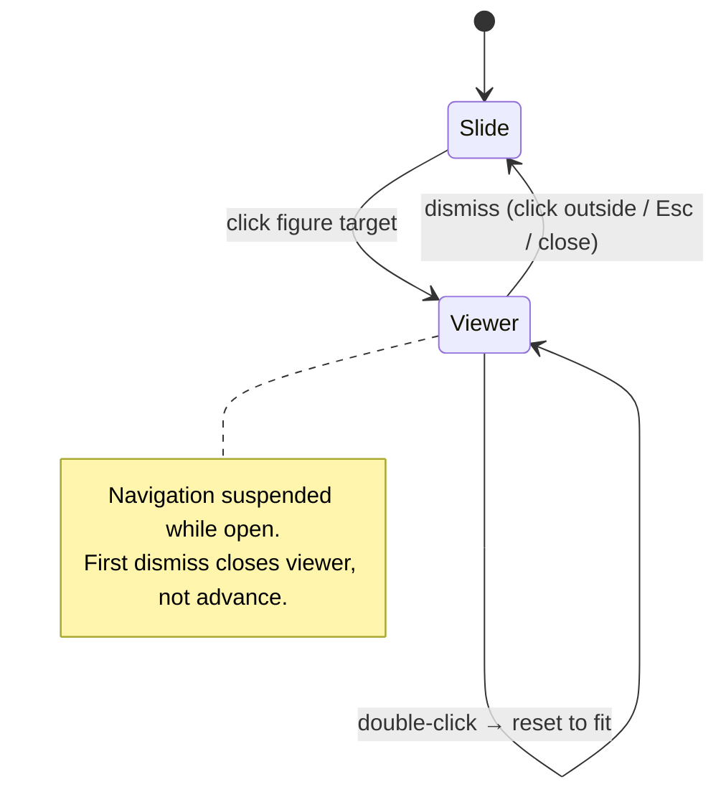
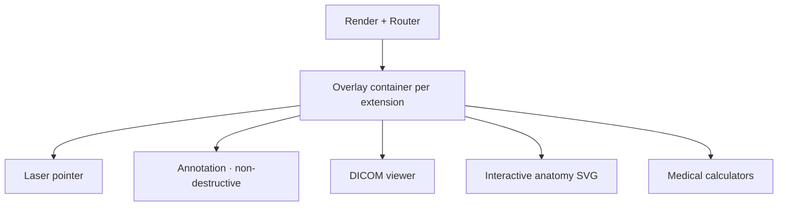

# INTERACTION.md

> **The overlay layer — interaction that never interferes with presentation flow.**
> This document owns: figure interaction lifecycle (click-to-enlarge, zoom, pan, double-click reset, dismiss), video playback, interactive SVG, and the future extension surface (annotation, laser pointer). The *pixel behavior* of figures lives in [FIGURE_ENGINE.md](FIGURE_ENGINE.md); the *slide-to-slide movement* lives in [NAVIGATION.md](NAVIGATION.md). This doc owns the *gestures, lifecycle, and isolation*.
> Entry: [../SKILL.md](../SKILL.md) · Behavior: [SKILL_RULES.md](SKILL_RULES.md).

**Interaction must never interfere with presentation flow** (decision hierarchy: enhancements are #7, below reliability #2). Every interaction is an overlay that draws on top and restores exact prior state.

---

## 1. The overlay model

All interaction lives in a layer **separate from rendering**. Strip the entire interaction layer and a correct, static slide remains.

Three invariants for **every** interaction (now and future):

1. **Never mutate the slide or model.** Overlays draw on top; they tear down cleanly.
2. **Restore exact prior state on exit.** Dismissing returns to the precise slide state you left ([NAVIGATION.md](NAVIGATION.md) §7).
3. **Fail safe.** An erroring overlay is isolated; the slide and navigation keep working.

The **Interaction Router** is shared with [NAVIGATION.md](NAVIGATION.md) §3 and enforces intent (only defined targets navigate; clicks on interactive elements don't advance).

---

## 2. Figure interaction lifecycle

- **Click-to-enlarge.** A single click/tap on a figure's overlay rect opens the Figure Viewer. (The rect is author-confirmed at build — [PPT_IMPORT.md](PPT_IMPORT.md) §6.)
- **Zoom & pan.** Provided by the viewer; the *pixel rules* (range 1×–4×, up to 8×; clamped pan; cursor-centered; legibility) are owned by [FIGURE_ENGINE.md](FIGURE_ENGINE.md) §4.
- **Double-click reset.** Double-click returns to fit-the-viewer scale.
- **Dismiss.** Click outside, `Esc`, or the close control returns to the exact prior slide state.
- **Navigation suspension.** While the viewer is open, slide navigation is suspended; the **first dismiss closes the viewer, not advances** — the joint rule with [NAVIGATION.md](NAVIGATION.md) §3.

---

## 3. Video playback

- **Native, offline.** Embedded clinical media (echo loops, angiography runs) plays inline at its authored position using **local files only** — never streams ([PPT_IMPORT.md](PPT_IMPORT.md) §7).
- **Controls.** Play/pause/seek; autoplay off by default; **loop preserved** for echo loops; mute-capable for silent clips.
- **Placement.** Plays in its authored rect; framing preserved.
- **Future.** Frame-step and click-to-enlarge video (zoom/pan a paused frame — [FIGURE_ENGINE.md](FIGURE_ENGINE.md) §8).

---

## 4. Interactive SVG

- Vector figures render as **SVG** and stay crisp at all zoom ([FIGURE_ENGINE.md](FIGURE_ENGINE.md) §2).
- v1 treats SVG figures as images (enlarge/zoom/pan).
- **Future:** SVG anatomy interaction (clickable/hoverable regions) as an extension (§5).

---

## 5. Extension surface (future interactions)

New interactions attach here without redesigning the core (`ARCHITECTURE.md` §11). Each extension is handed a **dedicated overlay container — not arbitrary DOM access** — so it can never reach the faithful background (preserving branding/citations by construction, [BRANDING.md](BRANDING.md), [CITATION.md](CITATION.md)).

- **Laser pointer mode** — mouse-driven highlight; pure overlay.
- **Annotation mode** — draw/markup over a slide, **non-destructive**, never saved into the source.
- **DICOM viewer / anatomy / calculators** — see [FIGURE_ENGINE.md](FIGURE_ENGINE.md) §8 and future `DICOM.md`, `MEDICAL_MEDIA.md`.

All inherit the §1 invariants: no mutation of the slide, exact-state restore, fail-safe, and constrained away from branding/citations.

---

## 6. What contributors must preserve

- **Never** let an overlay cover or displace a **citation** ([CITATION.md](CITATION.md) §3) or a **brand region** ([BRANDING.md](BRANDING.md) §5).
- **Never** let an interaction change the current slide as a side effect — only the Router's defined nav targets do that.
- **Never** add an interaction that can hang or crash the presentation — fail safe (decision hierarchy #2 over #7).
- **Never** persist interaction state back into the slide, model, or bundle.

---

## 7. Cross-references

- Figure pixel behavior (zoom range, pan clamp, caching): [FIGURE_ENGINE.md](FIGURE_ENGINE.md)
- Shared interaction router & nav suspension: [NAVIGATION.md](NAVIGATION.md) §3, §7
- Build-time confirmation of interactive rects: [PPT_IMPORT.md](PPT_IMPORT.md) §6
- Immutable elements overlays must avoid: [BRANDING.md](BRANDING.md), [CITATION.md](CITATION.md)
- Behavior & prohibitions: [SKILL_RULES.md](SKILL_RULES.md)
