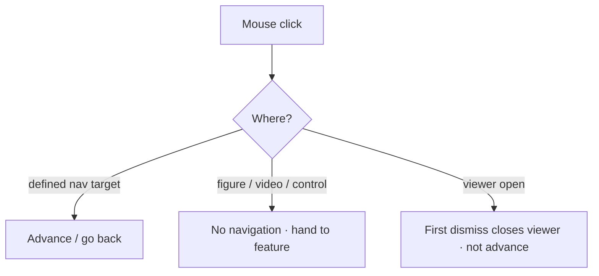
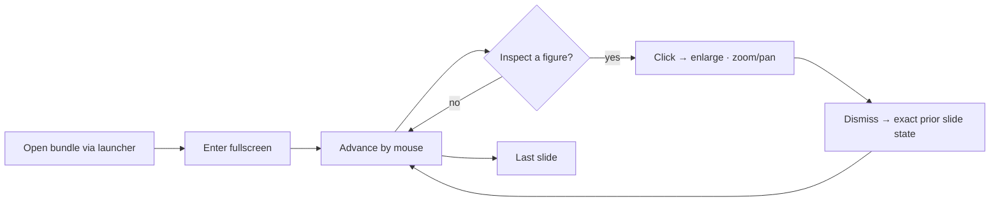

# NAVIGATION.md

> **Moving through the presentation — mouse-first, reliable, accident-resistant.**
> This document owns: mouse navigation (prev/next), fullscreen, presenter mode, keyboard fallback, navigation safety, and the live presentation workflow.
> Entry: [../SKILL.md](../SKILL.md) · Behavior: [SKILL_RULES.md](SKILL_RULES.md) · Interaction coordination: [INTERACTION.md](INTERACTION.md).

The presentation is **primarily controlled by mouse**. Reliability outranks every navigation nicety (decision hierarchy #2).

---

## 1. Principles

1. **Mouse-first.** Every essential action — next, previous, fullscreen — is operable with the mouse alone.
2. **Immediate.** A slide change responds in **≤100 ms** on conference-grade hardware (adjacent slides are preloaded — see [FIGURE_ENGINE.md](FIGURE_ENGINE.md) §7).
3. **Accident-resistant.** It must be hard to advance by mistake; clicks on figures, controls, or active overlays do not change the slide.
4. **Order-faithful.** Navigation order is exactly the source slide order ([PPT_IMPORT.md](PPT_IMPORT.md) §4) — never reordered.
5. **Fail safe.** If any navigation enhancement errors, basic prev/next still works.

---

## 2. Core actions

| Action | Mouse (primary) | Keyboard (fallback, §5) |
|--------|-----------------|--------------------------|
| **Next slide** | Defined next-target / on-screen control | `→`, `Space` |
| **Previous slide** | Defined prev-target / on-screen control | `←` |
| **Fullscreen toggle** | On-screen control | `F` |
| **Exit viewer/fullscreen** | Click outside / close control | `Esc` |
| **First / last** | (overview, future) | `Home` / `End` |

Controls are **unobtrusive** and hideable during a talk; a slide-position indicator (e.g. `12 / 40`) is available but dismissible.

---

## 3. Navigation safety (accident prevention)

The single biggest live-talk failure mode is an accidental advance. The Navigation Engine enforces **intent** through an interaction router shared with [INTERACTION.md](INTERACTION.md).

- **Only defined targets navigate.** A click on a figure invokes the Figure Viewer ([INTERACTION.md](INTERACTION.md)), not a slide change.
- **Viewer coordination.** While the Figure Viewer is open, **navigation is suspended**; the first dismiss closes the viewer rather than advancing. This rule is shared and owned jointly with [INTERACTION.md](INTERACTION.md) §lifecycle.
- **No double-fire.** A single intent produces a single slide change.

---

## 4. Fullscreen

- Enters **true fullscreen** with no browser chrome.
- Toggleable by mouse; `Esc` exits.
- Fullscreen must not depend on the network or any remote API (offline-absolute).

---

## 5. Keyboard fallback

Keyboard is a **secondary** path, always available but never required:

- `→` / `Space` next · `←` prev · `F` fullscreen · `Esc` exit viewer/fullscreen · `Home`/`End` first/last.
- Focus is visible; controls are reachable for accessibility (REQUIREMENTS §12).

---

## 6. Presenter mode (scoped)

- **v1:** a minimal, reliable presenter aid — current slide + position indicator, optional adjacent-slide preview. No second-screen dependency that could fail mid-talk.
- **Future:** presenter notes view, slide **overview/grid** with thumbnail jump, jump-to-slide-by-number. These are additive and must preserve the ≤100 ms and fail-safe guarantees.

---

## 7. Presentation workflow (live)

The defining property: **inspecting a figure never loses your place.** Dismissing the viewer restores the exact prior slide state ([INTERACTION.md](INTERACTION.md) §lifecycle), and navigation resumes.

---

## 8. Cross-references

- Enlarge/zoom behavior and the shared interaction router: [INTERACTION.md](INTERACTION.md)
- Preload/timing that makes ≤100 ms possible: [FIGURE_ENGINE.md](FIGURE_ENGINE.md) §7
- Slide order & delivery/launcher: [PPT_IMPORT.md](PPT_IMPORT.md) §4, §8
- Behavior & prohibitions: [SKILL_RULES.md](SKILL_RULES.md)
