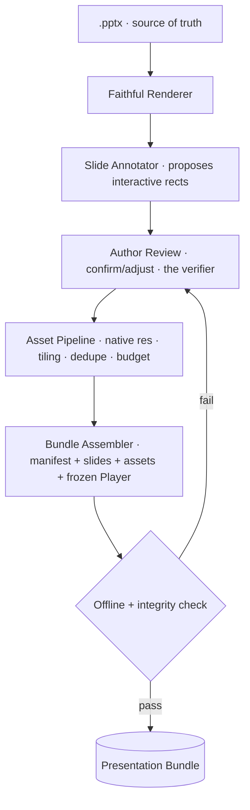

# PPT_IMPORT.md

> **The build pipeline: PowerPoint → Presentation Bundle.**
> This document owns: how a finished `.pptx` becomes a faithful, offline, interactive bundle. Parsing, layout/typography/figure extraction, theme & master-slide interpretation, brand preservation, slide compatibility, and PowerPoint's limitations.
> Entry: [../SKILL.md](../SKILL.md) · Behavior contract: [SKILL_RULES.md](SKILL_RULES.md) · Architecture: `ARCHITECTURE.md` (root).

**PowerPoint is always the source of truth.** Import preserves; it does not interpret or improve.

---

## 1. Responsibility & boundaries

The Importer is the **build world**: a one-time, possibly-slow, possibly-smart conversion run on the author's machine. It owns everything up to and including writing the **Presentation Bundle**. It owns *nothing* at runtime — see [NAVIGATION.md](NAVIGATION.md), [FIGURE_ENGINE.md](FIGURE_ENGINE.md), [INTERACTION.md](INTERACTION.md) for the Player.

What the Importer hands off (the contract):

> **Presentation Bundle** = `manifest.json` + faithful slide renders + `/assets` + the **frozen Player**.

---

## 2. The foundational decision: a slide is a faithful render + a thin overlay

Import is **hybrid**. Neither pure-OOXML reconstruction nor pure-image-with-auto-classification.

| Rejected approach | Why |
|-------------------|-----|
| **Reconstruct from OOXML** (rebuild shapes/text/effects in HTML) | Requires re-implementing PowerPoint's renderer (fonts, gradients, SmartArt, shadows). Huge, and fidelity — the one guarantee — is what we'd lose. |
| **Rendered images + auto-classify regions** | A bitmap has no regions; classifying figure vs. logo vs. citation from pixels is unreliable, and one mistake violates preservation. |

**Chosen — hybrid:**
- **Faithful background** per slide: **SVG** when the source is clean vector (figures stay crisp at any zoom), **high-resolution raster** otherwise. Carries branding, citations, typography, text *exactly as authored*.
- **Thin overlay manifest**: the *only* structured data — transparent hit-targets for figures and videos, plus explicitly non-interactive zones. Everything unannotated is simply the faithful background.

**Consequence:** branding/citations/typography are pixels in the background → **immutable by construction**; there is no runtime theme/branding engine to police. See [BRANDING.md](BRANDING.md) §1.

---

## 3. Pipeline overview

Each stage below states its **purpose, what it preserves, and what it hands on**.

---

## 4. Stage 1 — Faithful Renderer (parsing & rendering)

**Purpose:** produce one pixel-faithful background per slide; capture deck facts.

- Drives PowerPoint's own high-fidelity export (or equivalent) to emit **per-slide SVG** (preferred) or **high-res raster**, choosing per slide by content (vector-clean → SVG; heavy effects/photos → raster).
- Preserves **slide count and order** exactly (no slide dropped, merged, or reordered).
- Records **deck facts**: slide count, order, **aspect ratio** (read from the source — 16:9 or 4:3 — never assumed).

**Hands on:** faithful backgrounds + deck facts.

> "Parsing" here means *driving a faithful export*, not reconstructing the slide. We never re-typeset the author's text.

---

## 5. Stage 2 — Slide Annotator (extraction, as proposals)

**Purpose:** propose the rectangles that need runtime behavior. **Proposes only** — never the final word (**propose-then-confirm**).

The Annotator emits draft overlay records. Where the source carries OOXML geometry, it uses that to seed candidates; otherwise it proposes by simple heuristics. It extracts the following *facets*, all as metadata + asset references, never by re-rendering:

### 5.1 Layout extraction
Capture each interactive region's geometry in **normalized/logical coordinates** (so the runtime scales without reflow). Record z-order where it matters for overlay hit-testing. The background already holds the visual layout; the Annotator only needs the *boxes that get behavior*.

### 5.2 Typography extraction
Typography is already pixels in the faithful background, so there is **nothing to re-style** at runtime. The Annotator records only what downstream needs: which fonts the source used (for the build's font-bundling check) and confirmation that no webfont is referenced. Hierarchy/spacing/margins are preserved by the render itself. See [BRANDING.md](BRANDING.md) §typography.

### 5.3 Figure extraction
Identify candidate **figures** (CT, MRI, angiography, echo frames, pathology, forest plots, Kaplan–Meier curves, tables, diagrams) and emit bounding boxes + **native-resolution asset references** + a **multi-panel flag** + a caption link. The Asset Pipeline (§7) later pulls the actual bytes. Detailed figure handling: [FIGURE_ENGINE.md](FIGURE_ENGINE.md).

### 5.4 Theme & master-slide interpretation
PowerPoint masters/layouts define repeated identity (logos, footer, the bottom blue line, background, citation style). The Annotator interprets masters to **locate immutable regions** and proposes them as **non-interactive zones** so no overlay can ever sit on them. It does **not** lift them into a runtime theme — they remain baked in the background. Ownership of these elements: [BRANDING.md](BRANDING.md); citation specifics: [CITATION.md](CITATION.md).

### 5.5 Brand preservation
Because branding is in the faithful background, preservation is automatic. The Annotator's only branding job is to **mark brand regions non-interactive** (so a figure overlay can't overlap a logo) and flag any slide where a candidate figure box overlaps a brand region for the author to resolve in Review.

**Hands on:** draft overlay records (figure rects, video rects, non-interactive zones, caption links).

---

## 6. Stage 3 — Author Review (the verifier)

**Purpose:** put a human between detection and a shipped slide. **This is the v1 fidelity gate.**

- Shows each faithful slide with proposed interactive rects.
- The author **confirms/adjusts** figure boundaries, marks non-interactive zones, links captions, and **visually verifies** the render matches their deck.
- On the offline/integrity gate failing (§8), control returns here — the loop has a clear owner.

Automated pixel-diff fidelity scoring is a **future** enhancement that *flags* suspect slides before review; it never replaces the human. See `ARCHITECTURE.md` §13.

**Hands on:** the **confirmed overlay manifest**.

---

## 7. Stage 4 — Asset Pipeline

**Purpose:** make every byte offline-ready and bounded. Full figure-quality rules live in [FIGURE_ENGINE.md](FIGURE_ENGINE.md); the build responsibilities:

- Collect figures at **native resolution**; **vector stays SVG**.
- Extract embedded **video** for native offline playback (no streaming) — see [INTERACTION.md](INTERACTION.md) §video.
- Generate **high-DPI variants** where useful (4K projectors).
- **Tile very large images** (seeds the future medical-image/DICOM path).
- **Content-address + dedupe**; write to `/assets`.
- **Enforce an asset budget** and emit a **size report**.
- Bundle **all fonts/CSS/JS/icons locally**.

**Hands on:** `/assets` + asset index.

---

## 8. Stage 5 — Bundle Assembler + Offline/Integrity Check

**Assembler** writes the versioned `manifest.json` (deck facts, slide order, aspect ratio, overlay records, asset index), copies faithful slides + `/assets`, and **embeds the frozen Player**. The Player is **frozen per bundle** — Player and manifest are always the same version, so there is no runtime version negotiation.

**Offline + integrity check (the gate):**
- **Zero external references** anywhere (any `http(s)://` fails the build).
- Every overlay record **resolves to a present asset**.
- Slide **count/order intact**; aspect ratio set.
- **Budget** respected.

Pass → final bundle. Fail → back to Review (§6).

### Delivery forms (the `file://` reality)
Double-clicking an HTML on `file://` breaks `fetch()` of the manifest, video, and fonts in common browsers. So the bundle ships as:
- **Default:** portable folder + a tiny **bundled launcher** (serves from `http://localhost`) — the reliable conference path.
- **Small decks:** a single **self-contained HTML** with assets inlined (base64).

Both are fully offline. We do **not** promise "just open the HTML" universally.

---

## 9. Slide compatibility

| Source feature | Handling |
|----------------|----------|
| Standard slides (figures, text, tables) | Fully supported — faithful render + figure overlays. |
| Vector figures / charts | Rendered as **SVG**; crisp at all zoom. |
| Photographic/medical images | **High-res raster**, native resolution, tiled if very large. |
| Embedded video (echo loops, angio runs) | Extracted for **native offline playback**; loop preserved. |
| Masters/layouts with branding | Interpreted to locate immutable regions; baked into the background. |
| 4:3 and 16:9 decks | Both supported; ratio read from source. |

---

## 10. PowerPoint limitations (explicit scope)

- **Staged builds / animations** (sequential reveals, appearing arrows) are **not supported in v1**. Each slide renders to its **final flattened state**. Later: **multi-state slides** (renderer emits N states; overlay steps through them) — additive, no redesign. See `ARCHITECTURE.md` §11.
- **Slide transitions** authored in PPT are not reproduced; the Player provides its own minimal, reliable transitions ([NAVIGATION.md](NAVIGATION.md)).
- **Live-editable text** is not preserved as editable — text is pixels in the faithful background (by design; preservation > editability).
- **Embedded fonts** must be bundled locally; if a font cannot be embedded, the faithful render still preserves its *appearance* (it's already rasterized/vectorized).
- **External/linked media** (network-hosted) is rejected by the offline check — media must be embedded/local.
- **Cross-machine pixel identity** is not guaranteed; the faithful background removes layout drift, which is what matters.

---

## 11. Cross-references

- Behavior & prohibitions: [SKILL_RULES.md](SKILL_RULES.md)
- Figures (quality, scaling, caching): [FIGURE_ENGINE.md](FIGURE_ENGINE.md)
- Immutable identity: [BRANDING.md](BRANDING.md)
- Citations: [CITATION.md](CITATION.md)
- Runtime interaction: [INTERACTION.md](INTERACTION.md) · navigation: [NAVIGATION.md](NAVIGATION.md)
- Slide-type layouts the import should expect: [PRESENTATION_PATTERNS.md](PRESENTATION_PATTERNS.md)
