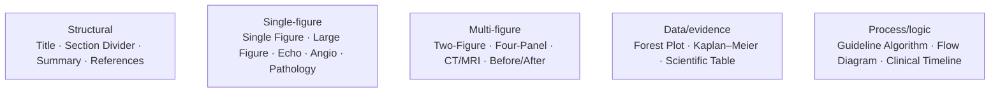
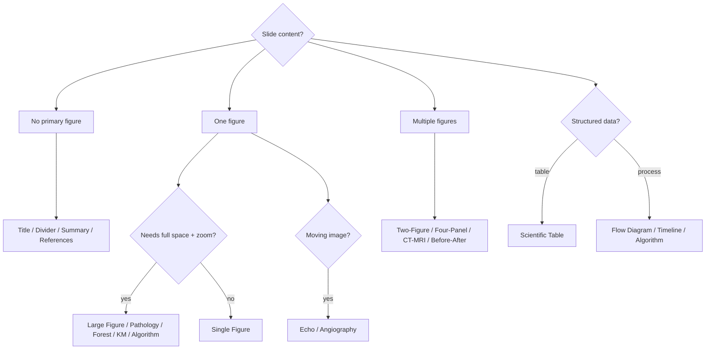

# PRESENTATION_PATTERNS.md

> **A library of reusable academic-medical slide patterns — layout primitives optimized for scientific communication.**
> This is **not** a collection of visual themes. It defines recurring slide *layouts* so the system (and future AI slide generation) can classify a slide and reason about figure priority, citation, and captions consistently.
> Entry: [../SKILL.md](../SKILL.md) · Figures: [FIGURE_ENGINE.md](FIGURE_ENGINE.md) · Citations: [CITATION.md](CITATION.md) · Branding: [BRANDING.md](BRANDING.md) · Interaction: [INTERACTION.md](INTERACTION.md).

---

## 1. How to use this document

A **pattern** is a recurring academic-medical slide layout. Patterns are **descriptive primitives**, not templates that override the author — the author's faithful render is always the truth ([PPT_IMPORT.md](PPT_IMPORT.md)). Patterns let the build *classify* a slide and let future tooling *reason* about it.

Every pattern is described with the same fields:

- **Purpose** — what the slide is for.
- **Typical use cases** — where it appears in a medical talk.
- **Figure priority** — how much the figure dominates (ties to [FIGURE_ENGINE.md](FIGURE_ENGINE.md) §2).
- **Recommended layout** — the canonical arrangement.
- **Citation placement** — where the reference sits (per [CITATION.md](CITATION.md): secondary, stable).
- **Caption placement** — where the figure label sits.
- **Common mistakes** — what violates preservation or scientific clarity.
- **Variations** — accepted variants.

> **Universal rules** (apply to every pattern, never repeated below): branding is immutable ([BRANDING.md](BRANDING.md)); citations are secondary and stable ([CITATION.md](CITATION.md)); figures keep native resolution and aspect ratio ([FIGURE_ENGINE.md](FIGURE_ENGINE.md)); large paragraphs never dominate; when uncertain, preserve ([SKILL_RULES.md](SKILL_RULES.md)).

---

## 2. Structural patterns

### 2.1 Title Slide
- **Purpose:** open the talk; establish topic, author, institution.
- **Typical use cases:** first slide of any presentation.
- **Figure priority:** none/low — text and institutional identity lead.
- **Recommended layout:** title + author/affiliation; hospital & university logos in their authored positions; footer + bottom blue line present.
- **Citation placement:** none (or a small source line if authored).
- **Caption placement:** n/a.
- **Common mistakes:** moving/resizing logos (immutable — [BRANDING.md](BRANDING.md)); adding decorative imagery the author didn't include.
- **Variations:** with/without a subtitle; with a single hero image if the author placed one.

### 2.2 Section Divider
- **Purpose:** signal a new section; give the audience a structural breath.
- **Typical use cases:** between major parts (Background → Methods → Results).
- **Figure priority:** none/low.
- **Recommended layout:** short section title centered; minimal content; branding intact.
- **Citation placement:** none.
- **Caption placement:** n/a.
- **Common mistakes:** turning a divider into a dense agenda; restyling to a "theme."
- **Variations:** numbered sections; with a one-line lead-in.

### 2.3 Summary Slide
- **Purpose:** consolidate take-home points.
- **Typical use cases:** near the end; "Conclusions / Key Messages."
- **Figure priority:** low–medium — a small recap figure may appear.
- **Recommended layout:** a few concise bullet take-homes; optional small supporting figure; text must not overflow into a wall ([SKILL_RULES.md](SKILL_RULES.md)).
- **Citation placement:** secondary; grouped if multiple sources are recapped.
- **Caption placement:** with any recap figure.
- **Common mistakes:** cramming every result back in; oversized text block dominating.
- **Variations:** bulleted vs. 3-box "key messages"; with/without a recap figure.

### 2.4 References Slide
- **Purpose:** list scientific references.
- **Typical use cases:** final slide(s).
- **Figure priority:** none.
- **Recommended layout:** ordered reference list in the author's citation format ([CITATION.md](CITATION.md) §4); legible at the back of a room.
- **Citation placement:** *is* the content — preserve the author's format, do not normalize.
- **Caption placement:** n/a.
- **Common mistakes:** reformatting/renumbering references; shrinking below legibility.
- **Variations:** single vs. multi-slide; numbered to match inline superscripts (future linking — [CITATION.md](CITATION.md) §4).

---

## 3. Single-figure patterns

### 3.1 Single Figure
- **Purpose:** present one figure as the slide's point.
- **Typical use cases:** a chart, schematic, or image supporting one claim.
- **Figure priority:** **high** — figure ~70–80% of usable area.
- **Recommended layout:** centered figure; brief title; caption beneath; citation secondary.
- **Citation placement:** bottom, near the figure, stable.
- **Caption placement:** directly under the figure.
- **Common mistakes:** shrinking the figure to fit added text; cropping to change aspect ratio.
- **Variations:** with/without a short interpretive line; click-to-enlarge enabled ([INTERACTION.md](INTERACTION.md)).

### 3.2 Large Scientific Figure
- **Purpose:** a single complex figure needing maximum space and zoom.
- **Typical use cases:** detailed mechanism diagrams, dense plots, whole-slide overviews.
- **Figure priority:** **maximal** — figure **~85–90%** of usable area.
- **Recommended layout:** figure fills the usable area; minimal chrome; **zoom/pan essential** ([FIGURE_ENGINE.md](FIGURE_ENGINE.md) §4).
- **Citation placement:** small, fixed corner; never overlapping the figure's data.
- **Caption placement:** compact, beneath or in a reserved strip.
- **Common mistakes:** adding a text column that steals figure space; relying on the figure being readable without zoom.
- **Variations:** raster (tiled if huge — pathology) vs. SVG (vector plots).

### 3.3 Echocardiography
- **Purpose:** show cardiac function via moving imaging.
- **Typical use cases:** echo loops (2D, Doppler, strain).
- **Figure priority:** **high** — the loop is the slide.
- **Recommended layout:** video centered; **native offline playback, loop preserved** ([INTERACTION.md](INTERACTION.md) §3); brief label.
- **Citation/caption:** caption identifies view/modality; citation secondary.
- **Common mistakes:** expecting streaming (must be local); autoplaying with sound; cropping the loop.
- **Variations:** single loop; side-by-side loops (treat as Two-Figure Comparison with video).

### 3.4 Angiography
- **Purpose:** show vascular anatomy/flow.
- **Typical use cases:** coronary/peripheral angiography runs or stills.
- **Figure priority:** **high.**
- **Recommended layout:** video run (native, offline) **or** high-res still; zoom/pan for stills.
- **Citation/caption:** caption notes vessel/projection; citation secondary.
- **Common mistakes:** down-sampling the still; losing the run's loop.
- **Variations:** run (video) vs. still (raster); pre/post-intervention as Before/After.

### 3.5 Pathology Image
- **Purpose:** present histology/cytology at meaningful magnification.
- **Typical use cases:** H&E, IHC, smears.
- **Figure priority:** **maximal** — detail matters most.
- **Recommended layout:** very high-res raster, **tiled** ([FIGURE_ENGINE.md](FIGURE_ENGINE.md) §7); deep zoom; scale/stain noted in caption.
- **Citation placement:** small fixed corner.
- **Caption placement:** stain + magnification beneath.
- **Common mistakes:** compressing away diagnostic detail; cropping/altering color.
- **Variations:** single field; multi-field as Four-Panel; prime candidate for future tiled viewer ([FIGURE_ENGINE.md](FIGURE_ENGINE.md) §8).

---

## 4. Multi-figure patterns

### 4.1 Two-Figure Comparison
- **Purpose:** compare two related figures.
- **Typical use cases:** pre/post, modality A vs. B, group A vs. B.
- **Figure priority:** **high, balanced** — two equally weighted figures.
- **Recommended layout:** side-by-side, equal size, aligned baselines; shared or mirrored captions.
- **Citation placement:** shared, centered-bottom or one per figure if sources differ.
- **Caption placement:** under each figure; parallel wording.
- **Common mistakes:** unequal sizing implying false emphasis; misaligned panels; different scales without saying so.
- **Variations:** future **synchronized zoom/pan** ([FIGURE_ENGINE.md](FIGURE_ENGINE.md) §5); vertical stack when aspect ratios demand.

### 4.2 Four-Panel Figure
- **Purpose:** present a composite of four related panels (A–D).
- **Typical use cases:** multi-condition results, sequential timepoints.
- **Figure priority:** **high** — composite preserved as one unit.
- **Recommended layout:** 2×2 grid **as authored**; panels never separated/rearranged ([FIGURE_ENGINE.md](FIGURE_ENGINE.md) §5); zoom into any panel.
- **Citation placement:** single, bottom.
- **Caption placement:** per-panel labels (A–D) preserved; one combined caption.
- **Common mistakes:** splitting the composite; relabeling panels; cropping a panel.
- **Variations:** 1×4 / 4×1 strips; mixed media within the composite.

### 4.3 CT / MRI Comparison
- **Purpose:** compare cross-sectional imaging.
- **Typical use cases:** sequences/timepoints/planes; normal vs. pathologic.
- **Figure priority:** **high, balanced.**
- **Recommended layout:** aligned panels, same plane/scale where applicable; window/level **as authored** (no runtime re-windowing in v1 — [FIGURE_ENGINE.md](FIGURE_ENGINE.md) §6).
- **Citation placement:** shared, secondary.
- **Caption placement:** sequence/plane noted per panel.
- **Common mistakes:** re-windowing; mismatched scales; cropping anatomy.
- **Variations:** 2-up to 4-up; future DICOM viewer for stack scroll ([FIGURE_ENGINE.md](FIGURE_ENGINE.md) §8).

### 4.4 Before/After Comparison
- **Purpose:** show change due to an intervention/time.
- **Typical use cases:** pre/post treatment, baseline/follow-up.
- **Figure priority:** **high, balanced.**
- **Recommended layout:** left=before, right=after, equal size, aligned; explicit labels.
- **Citation placement:** shared, secondary.
- **Caption placement:** "Before"/"After" + interval beneath each.
- **Common mistakes:** reversing order; unequal sizing; hiding the time interval.
- **Variations:** images or videos (echo/angio); synchronized zoom (future).

---

## 5. Data / evidence patterns

### 5.1 Forest Plot
- **Purpose:** present meta-analytic / subgroup effect estimates.
- **Typical use cases:** meta-analyses, subgroup analyses.
- **Figure priority:** **maximal** — the plot is the evidence.
- **Recommended layout:** vector → **SVG**, full width; CIs, point estimates, and labels must stay crisp; **zoom legibility critical** ([FIGURE_ENGINE.md](FIGURE_ENGINE.md) §4, §6).
- **Citation placement:** small fixed corner; never over the plot.
- **Caption placement:** outcome/model beneath.
- **Common mistakes:** rasterizing a vector plot (loses crispness); shrinking until CIs are unreadable; cropping the axis.
- **Variations:** single vs. stacked subgroups; with/without a summary diamond.

### 5.2 Kaplan–Meier Curve
- **Purpose:** show time-to-event / survival.
- **Typical use cases:** OS/PFS, event-free survival.
- **Figure priority:** **maximal.**
- **Recommended layout:** vector → **SVG**; **risk table** beneath the curve is small — zoom legibility is the key requirement ([FIGURE_ENGINE.md](FIGURE_ENGINE.md) §6).
- **Citation placement:** small fixed corner.
- **Caption placement:** endpoint + groups beneath; p-value/HR as authored.
- **Common mistakes:** dropping/clipping the risk table; rasterizing; obscuring censoring marks.
- **Variations:** with/without CI bands; multiple arms.

### 5.3 Scientific Table
- **Purpose:** present structured numeric/clinical data.
- **Typical use cases:** baseline characteristics, outcomes, lab panels.
- **Figure priority:** **high** — the table is the content; legibility is everything.
- **Recommended layout:** preserve the author's table exactly; **zoom to read** small cells; never reflow columns ([SKILL_RULES.md](SKILL_RULES.md) — no reflow).
- **Citation placement:** secondary, bottom.
- **Caption placement:** table title above (as authored).
- **Common mistakes:** reflowing/re-sorting; shrinking below legibility; converting to a "nicer" table that changes content.
- **Variations:** raster vs. vector; very large tables → tiling + zoom.

---

## 6. Process / logic patterns

### 6.1 Guideline Algorithm
- **Purpose:** present a clinical decision pathway.
- **Typical use cases:** management algorithms from guidelines.
- **Figure priority:** **high** — the algorithm is the figure.
- **Recommended layout:** preserve the authored flow exactly; zoom/pan for dense branches; often vector → SVG.
- **Citation placement:** small fixed corner (guideline source).
- **Caption placement:** title above; source noted.
- **Common mistakes:** re-drawing/re-laying-out the algorithm; cropping branches; changing decision wording.
- **Variations:** single decision tree; multi-step pathway; future interactive SVG branch highlighting ([INTERACTION.md](INTERACTION.md) §5).

### 6.2 Flow Diagram
- **Purpose:** show a process or participant flow.
- **Typical use cases:** CONSORT/PRISMA, study workflow, mechanism flow.
- **Figure priority:** **high.**
- **Recommended layout:** preserve authored nodes/edges; zoom/pan; counts/labels legible.
- **Citation placement:** secondary if from a source.
- **Caption placement:** title above.
- **Common mistakes:** re-flowing the diagram; altering counts; relabeling nodes.
- **Variations:** linear vs. branching; with/without exclusion counts.

### 6.3 Clinical Timeline
- **Purpose:** show events over time (course, protocol schedule).
- **Typical use cases:** disease course, treatment schedule, case chronology.
- **Figure priority:** **high.**
- **Recommended layout:** preserve the authored timeline axis and markers; horizontal scroll/zoom for long spans.
- **Citation placement:** secondary.
- **Caption placement:** title above; units noted.
- **Common mistakes:** rescaling the time axis; dropping events; reordering.
- **Variations:** single-track vs. multi-track; future interactive timeline ([INTERACTION.md](INTERACTION.md) §5, REQUIREMENTS NICE-TO-HAVE).

---

## 7. Pattern selection (classification aid)

This tree is an **aid for classification**, not a mandate — a slide is always rendered faithfully regardless of which pattern best describes it.

---

## 8. For future AI slide generation

These patterns are the vocabulary an AI assistant (`AI_ASSISTANT.md`, future) should reference:

- **Classify** an imported slide into a pattern to reason about figure priority, citation, and captions.
- **Suggest** (never impose) improvements only within preservation rules — e.g. flagging an unreadable forest plot for zoom, never re-laying it out.
- **Generate** net-new slides (when explicitly requested) using a pattern as a layout primitive, then subject to the same immutability/preservation rules as imported slides.

> Patterns describe how medical slides *are*; they never license redesigning what the author *made*.

---

## 9. Cross-references

- Figure rendering/zoom/tiling: [FIGURE_ENGINE.md](FIGURE_ENGINE.md)
- Citation placement/stability: [CITATION.md](CITATION.md)
- Immutable branding: [BRANDING.md](BRANDING.md)
- Enlarge/video/SVG interaction: [INTERACTION.md](INTERACTION.md)
- Navigation flow: [NAVIGATION.md](NAVIGATION.md)
- Build classification of slides: [PPT_IMPORT.md](PPT_IMPORT.md)
- Behavior & prohibitions: [SKILL_RULES.md](SKILL_RULES.md)
