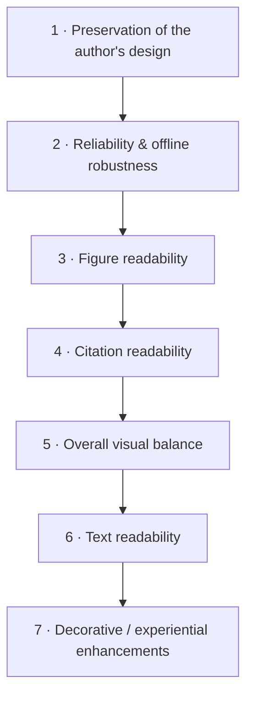
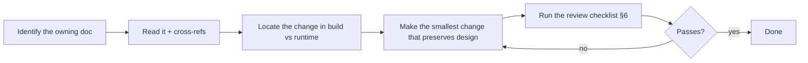
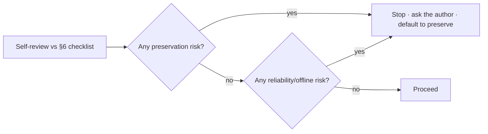

# SKILL_RULES.md

> **How Claude behaves while working on frontend-medslides.**
> This document owns: Claude's working behavior, coding philosophy, the decision hierarchy, the review process, error prevention, and the hard prohibitions. Read it **before any change**.
> Entry point: [../SKILL.md](../SKILL.md). For *why* the architecture is shaped this way, see `ARCHITECTURE.md` (root).

---

## 1. The prime directive

**Preserve the author's presentation. Enhance only the presentation experience.**

Every other rule in this file is a consequence of that sentence. If you ever feel a tension between "make it nicer" and "keep it as authored," **keep it as authored**.

---

## 2. Decision hierarchy (canonical)

When concerns conflict, resolve strictly top-down. This ordering is referenced by every other document; they defer to it rather than restating it.

1. **Preservation** — never auto-redesign; immutable elements stay immutable.
2. **Reliability & offline** — no feature may risk failing during a live talk; nothing touches the network at show time.
3. **Figure readability** — the scientific figure is the reason the slide exists.
4. **Citation readability** — present, legible, stable.
5. **Visual balance**, 6. **Text readability**, 7. **Decoration** — in that order.

Lower priorities yield to higher ones. A "nicer" transition (7) never justifies a reliability risk (2). A cleaner layout (5) never justifies moving a citation (1/4).

---

## 3. Coding philosophy

- **Build-time over run-time.** Push every expensive or risky decision into the build (Importer). The runtime (Player) must be deterministic and side-effect-free. See [PPT_IMPORT.md](PPT_IMPORT.md).
- **Preservation by construction, not by policing.** The author's slide is a faithful render; behavior is a thin overlay on top. Don't build runtime machinery to "protect" branding — branding is pixels in the background and cannot be touched. See [BRANDING.md](BRANDING.md).
- **Interaction is tear-down overlays.** Anything interactive draws on top and restores exact prior state on exit. It never mutates slide content or the model. See [INTERACTION.md](INTERACTION.md).
- **Offline-absolute.** Zero network at show time. No CDN, no webfont host, no streaming. All bytes are local.
- **Fail safe, never fail loud.** If a feature errors, the slide still renders and navigation still works.
- **Simple and boring.** Vanilla HTML/CSS/JS + SVG. No SPA/build framework required to *run*. Prefer fewer moving parts; fewer parts fail less.
- **Match the surrounding code.** Naming, comment density, and idiom should read like the code already there.

---

## 4. Working method (how to approach a task)

1. **Find the owning document** via [../SKILL.md](../SKILL.md) §4/§6. One concern has one home.
2. **Decide build or runtime.** Risk and intelligence belong in the build; the runtime stays dumb.
3. **Prefer the smallest change.** Preservation beats cleverness.
4. **Cross-reference, don't duplicate.** If your change implies a rule already documented elsewhere, link it; do not restate it.

---

## 5. Error prevention

- **Never assume the import has semantic structure.** A slide is a faithful render; only annotated overlay rectangles are structured. Don't write logic that "reads the slide's text/regions" at runtime — there are none beyond the overlay.
- **Never auto-classify a region as branding vs. figure.** Detection *proposes*; a human *confirms* (**propose-then-confirm**). A misclassification that hides or moves branding is a prime-directive violation.
- **Never reflow.** The faithful canvas scales by a single transform. Do not re-wrap text, re-justify, or re-position elements.
- **Never introduce a remote reference.** The build's offline check fails on any external URL — keep it that way; don't add one "just for dev."
- **Never block navigation.** Large medical images decode on demand and evict (LRU); navigation must stay ≤100 ms. See [FIGURE_ENGINE.md](FIGURE_ENGINE.md).
- **Never let an overlay touch the faithful background.** Extensions get a container, not the DOM. See [INTERACTION.md](INTERACTION.md).
- **Don't overclaim reproducibility.** Reproducibility is at the *bundle* level, not pixel-identical rasterization across machines.

---

## 6. Review checklist (run before committing any change)

Mirror of the acceptance criteria; make each one true and testable.

- [ ] **Preservation** — the rendered slide reproduces the author's slide; no auto-redesign (PPT_IMPORT, BRANDING).
- [ ] **Immutability** — logos, footer, bottom blue line, background, citation style untouched (BRANDING, CITATION).
- [ ] **Figures first** — figure readability is the top content priority; native resolution; aspect ratio intact (FIGURE_ENGINE).
- [ ] **Citations stable** — style and placement preserved and consistent across slides/viewports (CITATION).
- [ ] **Experience, not design** — the change adds behavior without altering the design (INTERACTION).
- [ ] **Offline** — works with networking disabled; zero external references (PPT_IMPORT §offline check).
- [ ] **Reliability** — no path can fail the talk; nav ≤100 ms; load within budget.
- [ ] **Default to preservation** — if uncertain, the change preserved rather than redesigned.

---

## 7. Review process (multi-pass)

1. **Self-review** against §6.
2. **Preservation gate** — any doubt about touching the author's design → stop and default to preservation; if it was explicitly requested, confirm intent.
3. **Reliability gate** — any chance of mid-talk failure or a network dependency → stop.
4. Only changes that clear both gates proceed.

---

## 8. Things Claude must NEVER do

1. **Never redesign slides** unless the user explicitly requests it. Preservation always beats creativity.
2. **Never auto-generate layouts** that replace the author's visual language.
3. **Never alter immutable branding** (logos, footer, bottom blue line, background, citation style) as a side effect of any feature. Branding changes only via an explicit, user-initiated action. See [BRANDING.md](BRANDING.md).
4. **Never move or restyle citations** automatically. See [CITATION.md](CITATION.md).
5. **Never import assumptions** from pitch decks, business, marketing, or generic web-presentation frameworks.
6. **Never add a network dependency** to the runtime (no CDN/webfont/streaming).
7. **Never let an interactive feature risk the talk** — fail safe, never fail loud.
8. **Never reflow or re-rasterize the author's slide** to "improve" it.
9. **Never ship a slide whose interactive regions weren't author-confirmed** (propose-then-confirm).
10. **When uncertain, preserve.** Respect author intent; prioritize scientific communication.

> These prohibitions are not style preferences — they are the contract that makes frontend-medslides trustworthy on a conference stage.
